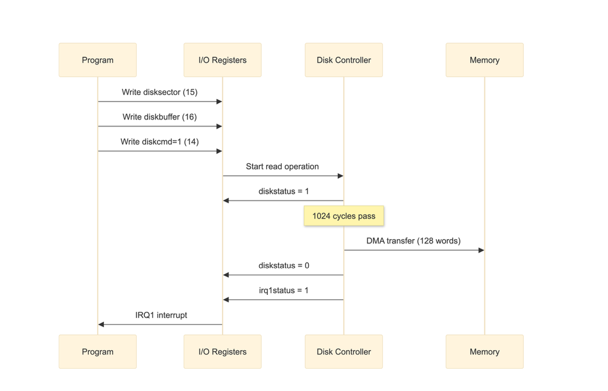

# SIMP Processor Toolchain

## Overview / The Task
This project involves building a complete software toolchain—an Assembler and a Simulator—for a custom processor architecture named "SIMP". Alongside the toolchain, we were tasked with developing four distinct assembly programs to test and demonstrate the processor's full capabilities, including its I/O peripherals, memory management, and interrupt handling.

**System Architecture:** Assembly source flows through the assembler to produce the initial memory image, which the simulator then executes to generate various hardware state outputs.

---

## How We Implemented It

### 1. The Assembler (`asm.c`) & Architecture
The assembler is the first stage of our pipeline, translating SIMP assembly source code into machine code (`memin.txt`). 
* We implemented a classic **two-pass algorithm**:
  * **Pass 1:** Scans the code to collect labels and builds the symbol table.
  * **Pass 2:** Generates the final machine code by resolving addresses.
* The parsing logic carefully distinguishes between R-format instructions and I-format instructions (which utilize the `$imm` register for immediate values) to accurately advance the program counter.

#### Instruction Set (ISA)
The SIMP architecture supports 22 instructions, translated by the Assembler:

| Opcodes | Operations Category | Examples |
|---|---|---|
| 0-2 | Arithmetic | `add`, `sub`, `mul` |
| 3-7 | Logical & Shift | `and`, `or`, `xor`, `sll`, `sra`, `srl` |
| 8-13 | Branching (Conditional) | `beq`, `bne`, `blt`, `bgt`, `ble`, `bge` |
| 14 | Jump & Link | `jal` (for function calls) |
| 15-16 | Memory Access | `lw` (load word), `sw` (store word) |
| 17 | Interrupt Return | `reti` |
| 18-20 | Hardware I/O | `in`, `out` |
| 21 | Control | `halt` |

#### Register File
The processor uses 16 general-purpose registers during execution:

| Index | Register | Description |
|---|---|---|
| 0 | `$zero` | Constant 0 (hardwired, writes ignored) |
| 1 | `$imm` | Immediate value (from I-format instructions) |
| 2 | `$v0` | Return value from function |
| 3-6 | `$a0` - `$a3` | Arguments to function |
| 7-9 | `$t0` - `$t2` | Temporary registers (caller-saved) |
| 10-12 | `$s0` - `$s2` | Saved registers (callee-saved) |
| 13 | `$gp` | Global pointer (static data) |
| 14 | `$sp` | Stack pointer |
| 15 | `$ra` | Return address |

---

### 2. The Simulator (`sim.c`)
Once the machine code is generated, the simulator acts as the virtual machine, running a continuous Fetch-Decode-Execute loop.

**Simulator Main Loop:** The cycle order ensuring cycle-accurate execution, including clock updates, hardware interrupt checks, instruction processing, and timer updates.

* **Hardware Simulation:** It simulates a 4096-word memory array, 16 general-purpose registers, and 23 specific I/O registers.
* **Interrupt Controller:** We implemented a robust interrupt system evaluating IRQ signals at the start of each cycle. It handles Timer events (IRQ0), Disk DMA completion (IRQ1), and External timing events (IRQ2) without allowing nested interrupts.

**Fetch-Decode-Execute Cycle:** The complete instruction processing flow within the processor, including format decoding and immediate value sign-extension.

#### I/O Registers (Memory-Mapped Hardware)
The simulator implements 23 hardware I/O registers to interact with external peripherals:

| Index | Name | Description |
|---|---|---|
| 0-2 | `irq0enable` - `irq2enable` | Interrupt enables (Timer, Disk, External) |
| 3-5 | `irq0status` - `irq2status` | Interrupt status flags (1 = pending) |
| 6-7 | `irqhandler`, `irqreturn` | Interrupt handler address and return PC |
| 8 | `clks` | Clock cycle counter (read-only) |
| 9-10 | `leds`, `display7seg` | 32 LEDs state and 7-segment display output |
| 11-13 | `timerenable`, `timercurrent`, `timermax` | Timer controls (fires IRQ0 when current==max) |
| 14-17 | `diskcmd`, `disksector`, `diskbuffer`, `diskstatus`| DMA Disk controller (read/write, memory address, status) |
| 20-22 | `monitoraddr`, `monitordata`, `monitorcmd` | Frame buffer controls for the 256x256 pixel display |

* **Peripherals & DMA:** The system supports Direct Memory Access (DMA) for the simulated hard disk (requiring a 1024-cycle delay) and controls a 256x256 pixel monitor through memory-mapped I/O.

**Disk Operations & DMA Sequence:** Demonstrating hardware interaction involving command issuing, a 1024-cycle delay, Direct Memory Access (DMA) transfer, and interrupt generation.

---

### 3. Assembly Programs
To prove the architecture's correctness, we wrote the following programs from scratch and ran them on our toolchain:
* **`sort.asm`:** A Bubble Sort algorithm sorting an array of 16 integers.
* **`binom.asm`:** Computes the Binomial Coefficient recursively, demonstrating manual stack frame management and function calls.
* **`triangle.asm`:** Draws a filled right triangle on the monitor using a scanline filling algorithm and division-by-subtraction.
* **`disktest.asm`:** Reads sectors from the disk using DMA polling, computes element-wise sums, and writes the result back to a new sector.

---

## Full Documentation
For an in-depth look at the architecture, memory layout, and implementation challenges (such as handling DMA timing and two-pass label resolution), please refer to the full project documentation:
📄 **[SIMP Project Documentation PDF](SIMP_Project_Documentation.pdf)**
